<div align="center">

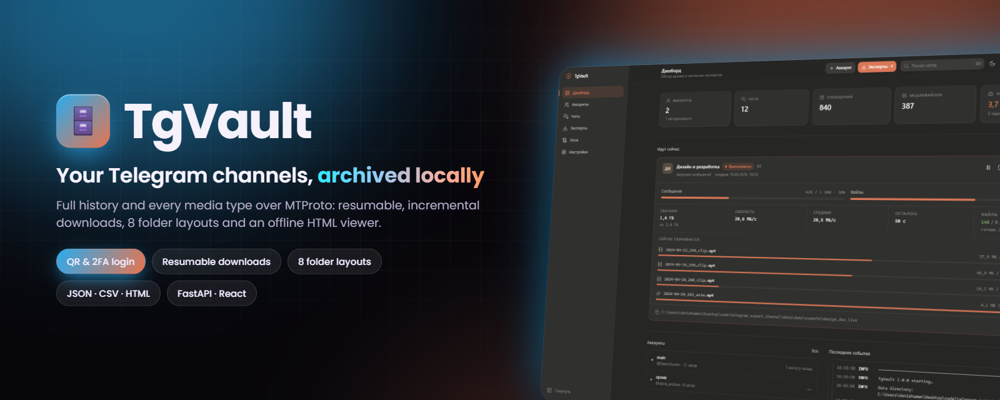

# TgVault

**A complete local archive of your Telegram channels and chats.**
Messages, photos, videos, round video notes, voice messages, documents and stickers — on your own disk, organised into folders the way you want.

[](#-quick-start)
[](https://fastapi.tiangolo.com)
[](https://react.dev)
[](https://github.com/LonamiWebs/Telethon)
[](docker/docker-compose.yml)
[](https://github.com/DenisHumen/telegram_export/commits/main)

**English** · [Русский](README.ru.md)

[Features](#-features) · [Screenshots](#-screenshots) · [Quick start](#-quick-start) · [Usage](#-usage) · [Documentation](#-documentation)

</div>

---

Telegram makes it hard to properly export a channel: the official export exists only in Telegram Desktop, it is limited in the file types it handles, and it can neither resume nor retry. TgVault connects to your account over MTProto, pulls the full history and stores everything in a local database — so the next export downloads only what is new.

It runs locally, with no server of its own and no telemetry, and starts with a single command.

> [!NOTE]
> The web interface and the detailed guides in [`docs/`](docs) are in Russian.

<div align="center">
  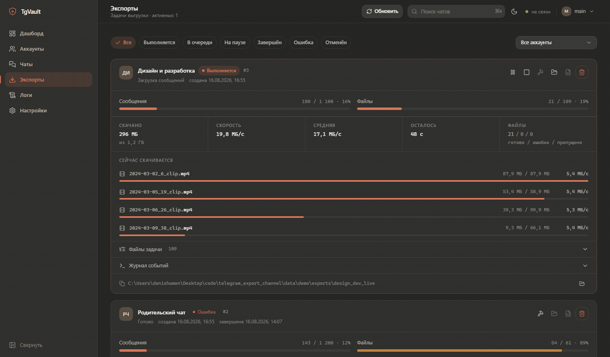
</div>

## ✨ Features

| | |
|---|---|
| 👥 **Multiple accounts** | Each account has its own session and its own archive; deleting an account removes its data in cascade. |
| 🔑 **Three ways to sign in** | QR code, phone number + code, and the 2FA cloud password (works on top of both). |
| 🖼 **Every media type** | Photos, videos, **round video notes**, voice messages, audio, documents, stickers, GIFs, thumbnails, avatars. |
| 🗂 **8 layout strategies** | By type, by date, by sender, by album, by size and combinations — plus your own file-name template. |
| 🛡 **Nothing gets lost** | Retries until a file downloads, resumes from the exact byte where it stopped, and a final pass that picks up anything still missing. |
| 🔁 **Incremental** | The second run fetches only new messages; everything already downloaded is skipped. |
| 📈 **Live progress** | See which files are downloading right now, the speed of each, the average speed and the ETA. |
| 🌐 **Offline viewer** | An `index.html` next to the archive: opens with a double click, round video notes play in a circle. |
| 📄 **Export formats** | JSON, JSONL, CSV, TXT, HTML + `manifest.json` with statistics. |
| ⏯ **Pause and resume** | Pause or cancel a job; after an app restart it goes back into the queue. |

## 📸 Screenshots

<table>
  <tr>
    <td width="50%">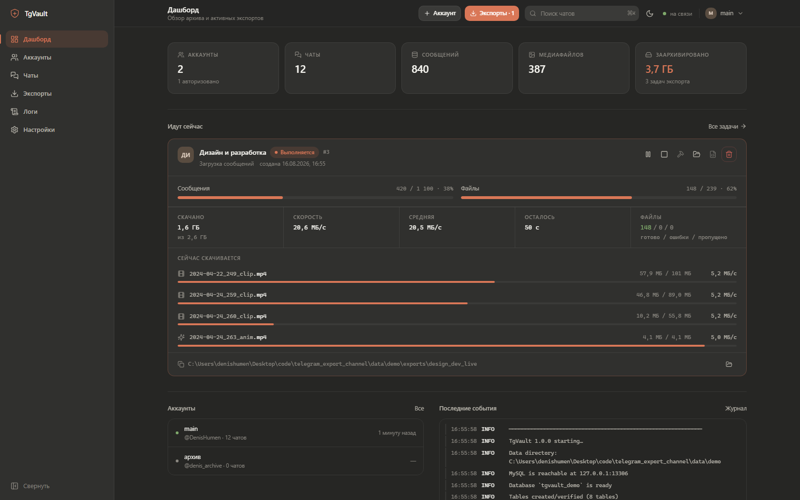<p align="center"><b>Dashboard</b> — archive status and active jobs</p></td>
    <td width="50%">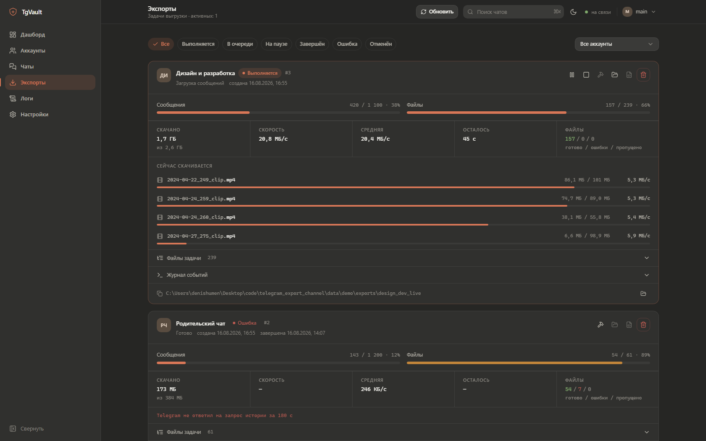<p align="center"><b>Exports</b> — progress, speed and what is downloading right now</p></td>
  </tr>
  <tr>
    <td>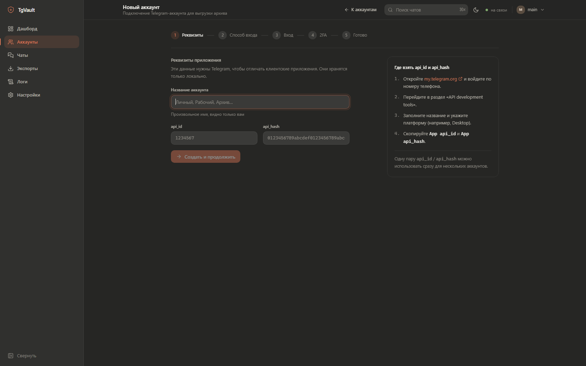<p align="center"><b>Sign in with a QR code</b></p></td>
    <td>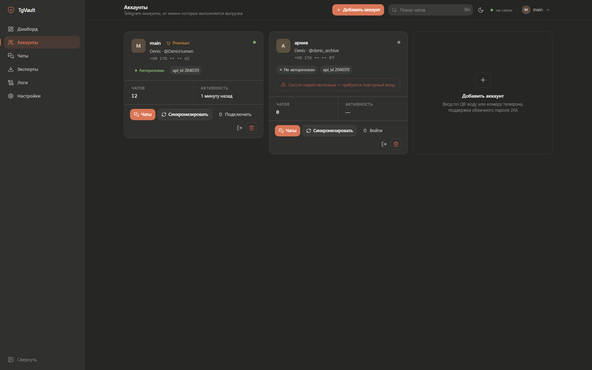<p align="center"><b>Accounts</b> — several accounts, each with its own session</p></td>
  </tr>
  <tr>
    <td>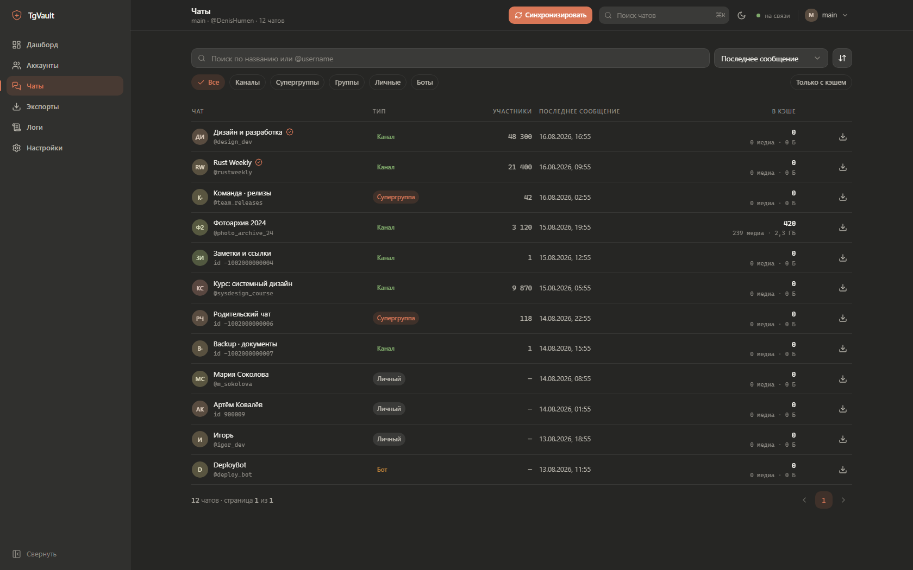<p align="center"><b>Chats</b></p></td>
    <td>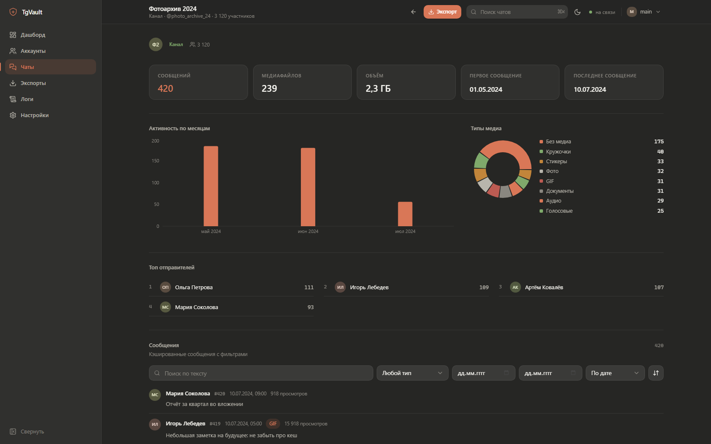<p align="center"><b>Chat statistics</b> — activity, media mix, top senders, archive browser</p></td>
  </tr>
  <tr>
    <td>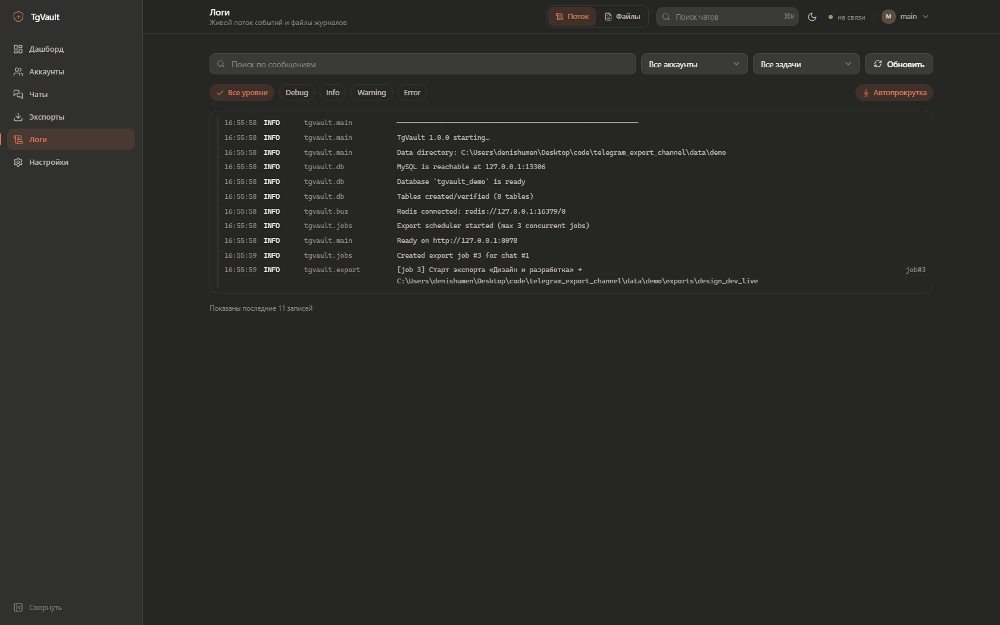<p align="center"><b>Logs</b> — live event stream with filters</p></td>
    <td>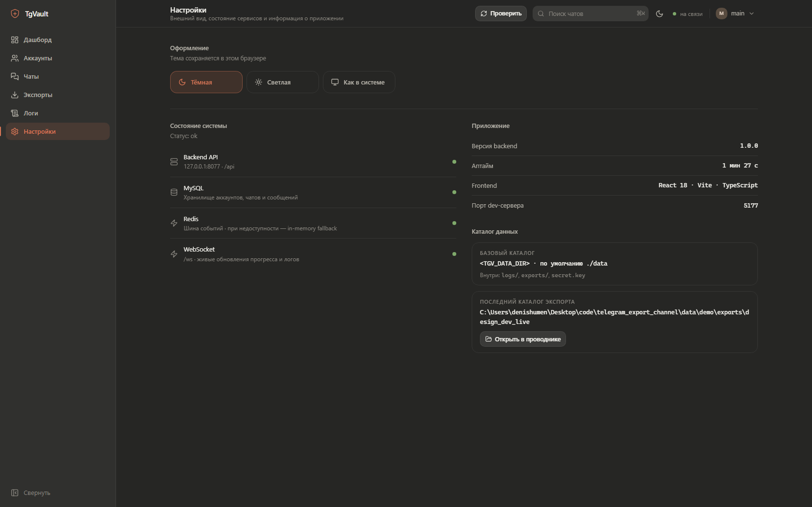<p align="center"><b>Settings</b> — theme, service health, data folder</p></td>
  </tr>
  <tr>
    <td>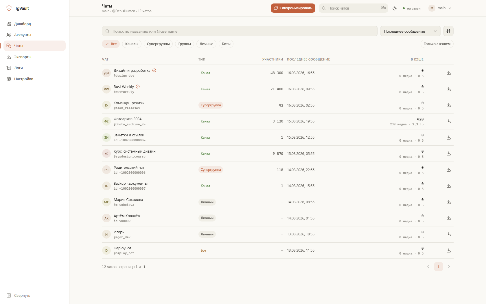<p align="center"><b>Light theme</b></p></td>
    <td>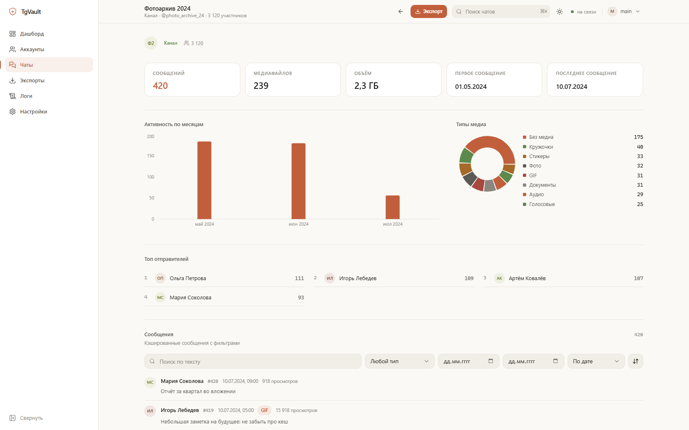<p align="center"><b>Chat statistics</b>, light theme</p></td>
  </tr>
</table>

## 🚀 Quick start

> [!NOTE]
> TgVault itself runs on your machine (Python + a built React UI). **Docker is used only for the infrastructure** — MySQL 8 and Redis 7 from [`docker/docker-compose.yml`](docker/docker-compose.yml). There is no application image.

### Requirements

| Component | Version | Why |
|---|---|---|
| Python | ≥ 3.10 (tested on 3.12 and 3.14) | backend |
| Node.js + npm | ≥ 18 | building the UI only — without it the `--no-frontend` mode works (REST + WebSocket + Swagger at `/docs`) |
| Docker + Compose v2 | Docker Desktop 4.x / Docker Engine 24+ | MySQL 8 and Redis 7 |
| Bash | Git Bash on Windows; any shell on Linux / macOS / WSL | `start.sh` / `stop.sh` / `status.sh` |

### 1. Docker

MySQL and Redis run in containers, so Docker is required.

**Linux (Fedora, Ubuntu, Debian, RHEL, Rocky, Alma)** — use the script from [DenisHumen/toolkit](https://github.com/DenisHumen/toolkit). It installs Docker and the compose plugin, enables the service and **adds you to the `docker` group** — without that step TgVault cannot open `/var/run/docker.sock`, even when the daemon is already running:

```bash
git clone https://github.com/DenisHumen/toolkit && cd toolkit
chmod +x linux/install-docker.sh
sudo ./linux/install-docker.sh --yes
```

Preview exactly what it will do without changing anything:

```bash
sudo ./linux/install-docker.sh --dry-run
```

The new group applies to an already open terminal only after `newgrp docker` (or logging in again):

```bash
newgrp docker
```

**Windows / macOS** — install [Docker Desktop](https://www.docker.com/products/docker-desktop), start it and wait until it says *Running*.

### 2. Run

```bash
git clone https://github.com/DenisHumen/telegram_export.git && cd telegram_export
./start.sh
```

The first start takes a couple of minutes: containers come up, the venv is created and the frontend is built. After that it takes seconds. Open **http://127.0.0.1:8077**.

Stop:

```bash
./stop.sh
```

Check status:

```bash
./status.sh
```

> [!IMPORTANT]
> **Windows:** run the scripts from **Git Bash**, not from `cmd.exe` or PowerShell.

On first start `start.sh` copies `.env.example` to `.env` and generates `TGV_SECRET_KEY`; an existing `.env` is never overwritten. The same actions are available through `make` (`make help` lists `start`, `dev`, `api`, `stop`, `restart`, `status`, `logs`, `rebuild`, `fresh`, `purge`, `compose-config`).

<details>
<summary><b><code>start.sh</code>, <code>stop.sh</code> and <code>status.sh</code> flags</b></summary>

| `start.sh` flag | Action |
|---|---|
| `--no-docker` | don't touch Docker; MySQL/Redis are already running and described in `.env` |
| `--sudo-docker` | call Docker through `sudo` (user not in the `docker` group). `stop.sh` accepts it too |
| `--no-frontend` | API only: npm is not run, the frontend is not built |
| `--dev` | run the Vite dev server on `TGV_FRONTEND_PORT` (5177) instead of the built `frontend/dist` |
| `--rebuild` | force-reinstall Python dependencies and rebuild the frontend |
| `--fresh` | recreate the Docker volumes — **deletes all database data**; asks you to type `yes` |
| `--port N` | run the backend on port `N` instead of `TGV_PORT` (`--port=N` works too) |
| `--no-browser` | don't open the browser after start |
| `--logs` | stay in `tail -f` after start; `Ctrl+C` leaves the logs, services keep running |
| `-h`, `--help` | help |

| `stop.sh` flag | Action |
|---|---|
| *(none)* | stop the app and the containers, keep the volumes |
| `--keep-db` | stop only backend and frontend; MySQL and Redis keep running |
| `--purge` | stop everything and delete the Docker volumes — **deletes the whole database**; asks you to type `yes` |
| `--sudo-docker` | call Docker through `sudo` |

`./status.sh` prints a status table; `./status.sh --json` prints the raw `/api/health` response for scripts.

</details>

<details>
<summary><b>Manual start with Docker Compose (without <code>start.sh</code>)</b></summary>

```bash
cp .env.example .env    # TGV_SECRET_KEY may stay empty: a key is then generated in data/secret.key

# Infrastructure: MySQL 8 on 13306, Redis 7 on 16379
docker compose --env-file .env -f docker/docker-compose.yml up -d

# Backend (Git Bash on Windows: source backend/.venv/Scripts/activate)
python -m venv backend/.venv && source backend/.venv/bin/activate
pip install -r backend/requirements.txt
cd backend && uvicorn app.main:app --host 127.0.0.1 --port 8077 --reload
```

Frontend in dev mode, in a second terminal (Vite listens on `5177` and proxies `/api` and `/ws` to `127.0.0.1:8077`):

```bash
cd frontend && npm install && npm run dev
```

Or build the production bundle that the backend serves itself: `cd frontend && npm run build`. Swagger UI is always available at <http://127.0.0.1:8077/docs>.

</details>

<details>
<summary><b>External MySQL and Redis</b></summary>

If the database and cache already exist, set the credentials in `.env` (`TGV_MYSQL_HOST`, `TGV_MYSQL_PORT`, `TGV_MYSQL_USER`, `TGV_MYSQL_PASSWORD`, `TGV_MYSQL_DB`, `TGV_REDIS_URL`) and run:

```bash
./start.sh --no-docker
```

MySQL 8.0+ with `utf8mb4` / `utf8mb4_unicode_ci` is required. Redis is optional: with `TGV_REDIS_ENABLED=false` the event bus falls back to in-process delivery. Details: [docs/SETUP.md](docs/SETUP.md).

</details>

### 3. `api_id` and `api_hash`

Telegram requires a pair of application keys — this is not your account password.

1. <https://my.telegram.org> → sign in with your phone number
2. **API development tools** → fill in the title and platform (Desktop)
3. Copy **App api_id** and **App api_hash**

One pair is normally used for several accounts — that is how Telegram designed it. You can put it into `.env` (`TGV_DEFAULT_API_ID` / `TGV_DEFAULT_API_HASH`) so you don't have to enter it every time.

### 4. First export

Accounts → **Add account** → enter the keys → choose **QR code** (faster) or phone number → enter the cloud password if 2FA is on → **Sync** chats → pick a channel → **Export**.

## ⚙️ Configuration

All settings are `TGV_`-prefixed environment variables read from the project-root `.env` (see [`.env.example`](.env.example)).

<details>
<summary><b>Environment variables</b></summary>

| Variable | Default | Description |
|---|---|---|
| `TGV_HOST` / `TGV_PORT` | `127.0.0.1` / `8077` | Backend address and port |
| `TGV_LOG_LEVEL` | `INFO` | Console log level; `app.log` always gets `DEBUG` |
| `TGV_DATA_DIR` | `./data` | Data root: `logs/`, `exports/`, `avatars/`, `run/`, `secret.key` |
| `TGV_SECRET_KEY` | empty | Master secret for encrypting sessions; empty → generated into `data/secret.key` |
| `TGV_MYSQL_HOST` / `TGV_MYSQL_PORT` | `127.0.0.1` / `13306` | MySQL (non-standard port to avoid clashing with a local server) |
| `TGV_MYSQL_USER` / `TGV_MYSQL_PASSWORD` / `TGV_MYSQL_DB` | `tgvault` / `tgvault` / `tgvault` | MySQL credentials; the database is created on start |
| `TGV_DB_ECHO` | `false` | Log every SQL statement |
| `TGV_REDIS_URL` | `redis://127.0.0.1:16379/0` | Event bus |
| `TGV_REDIS_ENABLED` | `true` | `false` — in-memory event bus, no Redis |
| `TGV_DEFAULT_API_ID` / `TGV_DEFAULT_API_HASH` | empty | Default Telegram app keys for new accounts |
| `TGV_MAX_RETRIES` | `5` | Attempts per `iter_messages` step and per file download |
| `TGV_FLOOD_SLEEP_THRESHOLD` | `60` | FloodWait (seconds) below which Telethon sleeps by itself |
| `TGV_DOWNLOAD_CONCURRENCY` | `4` | Backend default for parallel downloads (1–16) when an export request omits `concurrency`; the UI sets it per job |
| `TGV_FRONTEND_PORT` | `5177` | Vite dev server port (`--dev`) |
| `TGV_DATABASE_URL` | empty | Full DSN override (ignores `TGV_MYSQL_*`) |
| `TGV_DB_POOL_SIZE` / `TGV_DB_MAX_OVERFLOW` | `10` / `20` | SQLAlchemy pool (MySQL) |
| `TGV_SERVE_FRONTEND` | `true` | `false` — API-only, don't serve `frontend/dist` |
| `TGV_REQUEST_RETRIES` / `TGV_CONNECTION_RETRIES` | `5` / `5` | Telethon client retries |
| `TGV_EXTRA_OPEN_ROOTS` | empty | Extra folders allowed for `POST /api/system/open-folder` (`;` on Windows, `:` on Unix); by default only `TGV_DATA_DIR` |
| `TGV_MYSQL_ROOT_PASSWORD`, `TGV_REDIS_PORT`, `TZ` | `tgvault_root`, `16379`, `UTC` | Used only by `docker/docker-compose.yml` |

Full reference: [docs/SETUP.md](docs/SETUP.md#4-справочник-env).

</details>

## 🧭 Usage

### Signing in with a QR code

The QR code is generated the same way as in Telegram Desktop: on your phone open **Settings → Devices → Link Desktop Device** and point the camera at it. The token lives for about a minute and refreshes automatically. If the account has a cloud password, a 2FA step appears after scanning — that is normal Telegram behaviour, not an error.

### Watching an export

Everything that happens is visible: how many messages have been read and files downloaded, the volume, current and average speed and the remaining time, and below that a list of files in progress with the progress and speed of each. Next to it — a collapsible list of all files in the job with status filters, and the job's event log.

For every chat you also get activity by month, a breakdown by media type, top senders and a browser for already archived messages with filters by type, date and text. The **Logs** page is a live stream of application events filtered by level, account and job, plus a tab with the log files themselves.

The theme is switched in the top bar: dark → light → system, and the choice is remembered. For screenshots and links, `?theme=light` forces a theme for one page load without overwriting the saved choice.

### File layout

This is what separates a proper archive from a dump. The strategy is picked visually when you configure an export:

| Strategy | Result |
|---|---|
| `flat` | `media/` — everything in one folder |
| `by_type` | `media/photos/`, `media/video_notes/`, `media/voice_messages/` |
| `by_date` | `media/2026/2026-01/` |
| `by_date_type` | `media/2026/2026-01/photos/` |
| `by_type_date` | `media/photos/2026-01/` *(default)* |
| `by_sender` | `media/Ivan_Petrov/` |
| `by_album` | `media/albums/<grouped_id>/` and `media/single/` |
| `by_size` | `media/small_lt10mb/`, `medium_lt100mb/`, `large_lt1gb/` |

The file name comes from a template, `{date}_{id}_{name}` by default. Available placeholders: `{id} {date} {time} {datetime} {name} {ext} {kind} {sender} {chat} {album}`.

Export result:

```
data/exports/design_dev_-1002026754053_20260816-150832/
├── manifest.json        # metadata, options, statistics, file list
├── messages.json        # full dump
├── messages.jsonl       # one message per line, for streaming
├── messages.csv
├── messages.txt
├── index.html           # offline viewer
├── assets/              # style.css, app.js, data.js
└── media/               # according to the chosen layout
```

### Why files don't get lost

Exporting a large channel takes hours, and something will break along the way. So:

* **Retries until it works.** A file is requested again until it downloads (`retry_forever`, on by default, with a runaway guard of `max_attempts` = 200 per file). Only truly permanent errors stop it — the media was deleted or access was revoked.
* **Resume from the break point.** An interrupted file continues from the last byte via `iter_download` instead of starting over. On a 2 GB video that is the difference between a minute and half an hour.
* **Final pass.** After the main pass the engine re-reads the messages (which refreshes the file reference — a common cause of failures) and picks up everything left. Passes continue until they stop producing results.
* **File references expire** — `FileReferenceExpiredError` is handled by re-reading that specific message.
* **FloodWait is normal.** Telegram's rate limit is not treated as an error: the pause is shown in the job log and work then continues.
* **A job can't hang silently.** Every call to Telegram has a timeout, and a watchdog stops the job with a clear error if there is no progress for too long. Restarting continues from the last saved message.

## 🧱 Architecture

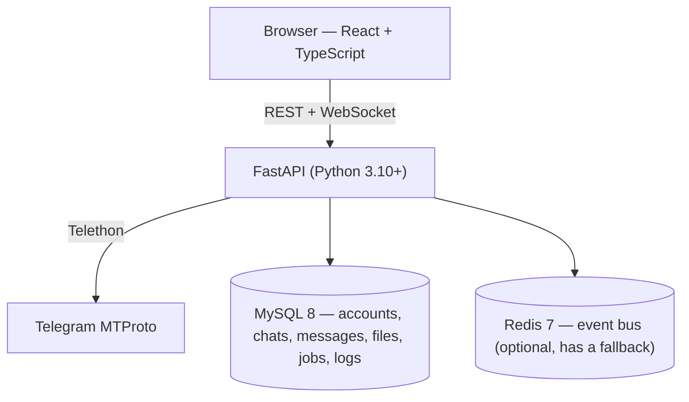

Everything that has been downloaded is recorded in MySQL, so a repeated export doesn't download anything again, and the output files can be rebuilt in another format or another layout without contacting Telegram at all (the **Rebuild** button).

- **Backend:** FastAPI, Uvicorn, Telethon, SQLAlchemy 2 (async) + aiomysql, redis-py, pydantic-settings, cryptography (Fernet)
- **Frontend:** React 18, TypeScript, Vite, Tailwind CSS, TanStack Query, Zustand, Recharts
- **Infrastructure:** MySQL 8 and Redis 7 via Docker Compose

More in [docs/ARCHITECTURE.md](docs/ARCHITECTURE.md).

## 📚 Documentation

Detailed guides (in Russian):

| Document | Topic |
|---|---|
| [SETUP](docs/SETUP.md) | Installation, `start.sh` flags, `.env` reference, external MySQL/Redis, backups |
| [USAGE](docs/USAGE.md) | End-to-end walkthrough, QR and 2FA, all export options, layouts, formats |
| [ARCHITECTURE](docs/ARCHITECTURE.md) | Components, diagrams, design decisions, failure model |
| [DATABASE](docs/DATABASE.md) | All tables and columns, ER diagram, SQL examples |
| [API](docs/API.md) | REST reference, WebSocket protocol, error codes |
| [TESTING](docs/TESTING.md) | The two test suites and what they have already caught |
| [TROUBLESHOOTING](docs/TROUBLESHOOTING.md) | Problem → cause → fix |
| [CONTRACT](docs/CONTRACT.md) | System contract — the source of truth for the code |
| [TELETHON_REFERENCE](docs/TELETHON_REFERENCE.md) | Verified Telethon facts the engine is built on |

## 🧪 Tests

```bash
cd backend
.venv/bin/python -m tests.smoke        # engine: 82 checks, needs only MySQL
.venv/bin/python -m tests.api_smoke    # API: 62 checks, needs a running backend
```

On Windows the interpreter path is `.venv/Scripts/python`.

The engine is tested against a fake Telegram client: media typing with all its ordering traps (a round video note also answers to `.video`), layouts, resuming after a break, retry-forever mode, incremental runs, cancelling a stuck job. Details in [docs/TESTING.md](docs/TESTING.md).

To look at the UI with realistic data without connecting a real account:

```bash
cd backend
.venv/bin/python -m tests.demo_server      # http://127.0.0.1:8078
```

## 🔒 Security and privacy

* Everything stays local: no telemetry and no external requests other than Telegram itself.
* Telegram sessions are encrypted (Fernet) with the key from `data/secret.key` instead of being stored in plain text.
* `.env`, `data/` and sessions are in `.gitignore`.
* **`data/secret.key` together with the database equals full access to the account.** Treat them like a password and don't put them in the cloud.
* On Linux, membership in the `docker` group is effectively root — that is Docker's standard trade-off. If it doesn't suit you, use `./start.sh --sudo-docker`.

## ⚠️ Limitations

* Telegram limits speed: on large channels FloodWait is unavoidable, and exporting tens of thousands of messages with media takes hours.
* Premium speeds up downloads, but the limits don't go away.
* `takeout` mode is supported, but Telegram may ask you to confirm the export on another device and wait up to a day — and, contrary to popular belief, it does **not** lift flood limits (see [TELETHON_REFERENCE](docs/TELETHON_REFERENCE.md)).
* Only what the account can access is downloaded: private channels you have been removed from cannot be exported.
* The same session cannot be used from two places at once — Telegram destroys the key (`AuthKeyDuplicatedError`) and requires a new sign-in.

## 📁 Project structure

```
telegram_export/
├── start.sh / stop.sh / status.sh   # the only entry points (Git Bash, WSL, Linux, macOS)
├── Makefile                         # thin wrapper around the scripts
├── .env.example                     # configuration template (copied to .env on first start)
├── docker/docker-compose.yml        # MySQL 8 + Redis 7
├── backend/
│   ├── requirements.txt
│   ├── app/
│   │   ├── main.py                  # FastAPI app, /api/health, serves frontend/dist
│   │   ├── config.py                # TGV_* settings
│   │   ├── api/                     # REST routes (accounts, auth, chats, export, logs) + WebSocket
│   │   ├── db/                      # SQLAlchemy models, session, bootstrap
│   │   ├── services/                # accounts, chats, jobs, layout, options, render
│   │   └── tg/                      # Telethon: auth, dialogs, exporter, extraction, client manager
│   └── tests/                       # smoke tests, fake Telegram, demo server
├── frontend/                        # React + TypeScript + Vite UI
└── docs/                            # detailed documentation (RU) and screenshots
```

## 🤝 Contributing

Issues and pull requests are welcome. [docs/CONTRACT.md](docs/CONTRACT.md) is the source of truth for behaviour, and [docs/TESTING.md](docs/TESTING.md) explains how to run the checks.

## 📄 License

License: not specified yet.

---

<div align="center">
<sub>A tool for personal archiving. Respect Telegram's Terms of Service and the privacy of the people whose messages end up in your export.</sub>
</div>
