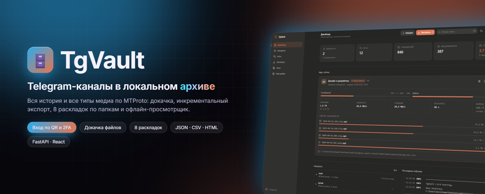
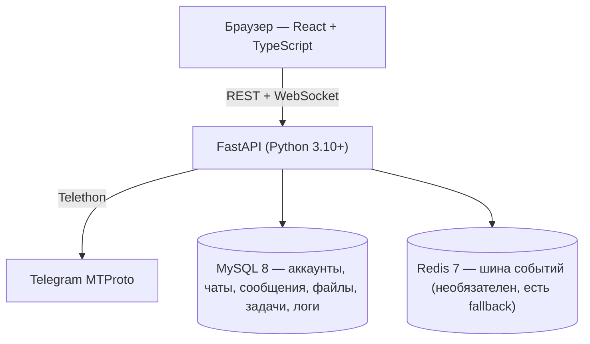

<div align="center">



# TgVault

**Полный локальный архив ваших Telegram-каналов и чатов.**
Сообщения, фото, видео, кружочки, голосовые, документы и стикеры — на вашем диске, разложенные по папкам так, как удобно вам.

[](#-быстрый-старт)
[](https://fastapi.tiangolo.com)
[](https://react.dev)
[](https://github.com/LonamiWebs/Telethon)
[](docker/docker-compose.yml)
[](https://github.com/DenisHumen/telegram_export/commits/main)

[English](README.md) · **Русский**

[Возможности](#-возможности) · [Скриншоты](#-скриншоты) · [Быстрый старт](#-быстрый-старт) · [Использование](#-использование) · [Документация](#-документация)

</div>

---

Telegram не даёт нормально выгрузить канал: официальный экспорт есть только в Desktop, он ограничен по типам файлов и не умеет ни докачивать, ни повторять попытки. TgVault подключается к вашему аккаунту по MTProto, забирает историю целиком и складывает всё в локальную базу — так что повторный экспорт скачивает только новое.

Работает локально, без сервера и без телеметрии. Поднимается одной командой.

<div align="center">
  
</div>

## ✨ Возможности

| | |
|---|---|
| 👥 **Несколько аккаунтов** | Каждый со своей сессией и своим архивом, удаление аккаунта уносит его данные каскадом. |
| 🔑 **Три способа входа** | QR-код, номер телефона + код, и облачный пароль 2FA (работает поверх обоих). |
| 🖼 **Все типы медиа** | Фото, видео, **кружочки** (video note), голосовые, аудио, документы, стикеры, GIF, превью, аватары. |
| 🗂 **8 стратегий раскладки** | По типу, по дате, по отправителю, по альбомам, по размеру и комбинации — плюс свой шаблон имени файла. |
| 🛡 **Ничего не теряется** | Повторы до победного, докачка с места обрыва, финальный проход по недокачанному. |
| 🔁 **Инкрементальность** | Второй запуск берёт только новые сообщения; всё уже скачанное пропускается. |
| 📈 **Живой прогресс** | Видно, какие файлы качаются прямо сейчас, скорость по каждому, средняя скорость и ETA. |
| 🌐 **Офлайн-просмотрщик** | `index.html` рядом с архивом: открывается двойным кликом, кружочки играют в круге. |
| 📄 **Форматы выгрузки** | JSON, JSONL, CSV, TXT, HTML + `manifest.json` со статистикой. |
| ⏯ **Пауза и продолжение** | Задачу можно поставить на паузу, отменить; после перезапуска приложения она вернётся в очередь. |

## 📸 Скриншоты

<table>
  <tr>
    <td width="50%"><p align="center"><b>Дашборд</b> — состояние архива и активные задачи</p></td>
    <td width="50%"><p align="center"><b>Экспорт</b> — прогресс, скорость и то, что качается прямо сейчас</p></td>
  </tr>
  <tr>
    <td><p align="center"><b>Вход по QR-коду</b></p></td>
    <td><p align="center"><b>Аккаунты</b> — несколько аккаунтов, у каждого своя сессия</p></td>
  </tr>
  <tr>
    <td><p align="center"><b>Чаты</b></p></td>
    <td><p align="center"><b>Статистика чата</b> — активность, медиа, топ отправителей, архив</p></td>
  </tr>
  <tr>
    <td><p align="center"><b>Логи</b> — живой поток событий с фильтрами</p></td>
    <td><p align="center"><b>Настройки</b> — тема, состояние сервисов, каталог данных</p></td>
  </tr>
  <tr>
    <td><p align="center"><b>Светлая тема</b></p></td>
    <td><p align="center"><b>Статистика чата</b>, светлая тема</p></td>
  </tr>
</table>

## 🚀 Быстрый старт

> [!NOTE]
> Само приложение TgVault работает на вашей машине (Python + собранный React-интерфейс). **Docker нужен только для инфраструктуры** — MySQL 8 и Redis 7 из [`docker/docker-compose.yml`](docker/docker-compose.yml). Отдельного образа приложения нет.

### Требования

| Компонент | Версия | Зачем |
|---|---|---|
| Python | ≥ 3.10 (проверено на 3.12 и 3.14) | backend |
| Node.js + npm | ≥ 18 | только для сборки UI — без него работает режим `--no-frontend` (REST + WebSocket + Swagger на `/docs`) |
| Docker + Compose v2 | Docker Desktop 4.x / Docker Engine 24+ | MySQL 8 и Redis 7 |
| Bash | Git Bash на Windows; любой shell на Linux / macOS / WSL | `start.sh` / `stop.sh` / `status.sh` |

### 1. Docker

MySQL и Redis поднимаются в контейнерах — Docker нужен обязательно.

**Linux (Fedora, Ubuntu, Debian, RHEL, Rocky, Alma)** — скриптом из [DenisHumen/toolkit](https://github.com/DenisHumen/toolkit). Он ставит Docker и compose-плагин, включает службу и **добавляет вас в группу `docker`** — без этого шага TgVault не сможет открыть `/var/run/docker.sock`, даже когда демон уже работает:

```bash
git clone https://github.com/DenisHumen/toolkit && cd toolkit
chmod +x linux/install-docker.sh
sudo ./linux/install-docker.sh --yes
```

Посмотреть, что именно он сделает, ничего не меняя:

```bash
sudo ./linux/install-docker.sh --dry-run
```

Группа применится к уже открытому терминалу только после `newgrp docker` (или перезахода):

```bash
newgrp docker
```

**Windows / macOS** — [Docker Desktop](https://www.docker.com/products/docker-desktop), запустить и дождаться статуса Running.

### 2. Запуск

```bash
git clone https://github.com/DenisHumen/telegram_export.git && cd telegram_export
./start.sh
```

Первый запуск занимает пару минут: поднимаются контейнеры, создаётся venv, собирается фронтенд. Дальше — секунды. Открывайте **http://127.0.0.1:8077**

Остановить:

```bash
./stop.sh
```

Посмотреть состояние:

```bash
./status.sh
```

> [!IMPORTANT]
> **Windows:** запускайте из **Git Bash**, не из `cmd.exe` и не из PowerShell.

При первом запуске `start.sh` копирует `.env.example` в `.env` и генерирует `TGV_SECRET_KEY`; существующий `.env` никогда не перезаписывается. То же самое доступно через `make` (`make help` покажет цели `start`, `dev`, `api`, `stop`, `restart`, `status`, `logs`, `rebuild`, `fresh`, `purge`, `compose-config`).

<details>
<summary><b>Флаги <code>start.sh</code>, <code>stop.sh</code> и <code>status.sh</code></b></summary>

| Флаг `start.sh` | Действие |
|---|---|
| `--no-docker` | не трогать docker; MySQL/Redis уже подняты и описаны в `.env` |
| `--sudo-docker` | вызывать docker через `sudo` (пользователь не в группе `docker`). Этот флаг понимает и `stop.sh` |
| `--no-frontend` | только API: npm не запускается, фронтенд не собирается |
| `--dev` | вместо собранного `frontend/dist` поднять Vite dev-сервер на `TGV_FRONTEND_PORT` (5177) |
| `--rebuild` | принудительно переустановить python-зависимости и пересобрать фронтенд |
| `--fresh` | пересоздать docker-тома — **удаляет все данные БД**; требует ввести `yes` |
| `--port N` | запустить backend на порту `N` вместо `TGV_PORT` (форма `--port=N` тоже работает) |
| `--no-browser` | не открывать браузер после старта |
| `--logs` | после старта остаться в `tail -f`; `Ctrl+C` выходит из логов, сервисы продолжают работать |
| `-h`, `--help` | справка |

| Флаг `stop.sh` | Действие |
|---|---|
| *(без флагов)* | остановить приложение и контейнеры, тома оставить |
| `--keep-db` | остановить только backend и frontend; MySQL и Redis продолжат работать |
| `--purge` | остановить всё и удалить docker-тома — **сносит всю базу**; требует ввести `yes` |
| `--sudo-docker` | вызывать docker через `sudo` |

`./status.sh` печатает таблицу состояния; `./status.sh --json` — ответ `/api/health` как есть, для скриптов.

</details>

<details>
<summary><b>Ручной запуск через Docker Compose (без <code>start.sh</code>)</b></summary>

```bash
cp .env.example .env    # TGV_SECRET_KEY можно оставить пустым — ключ создастся в data/secret.key

# Инфраструктура: MySQL 8 на 13306, Redis 7 на 16379
docker compose --env-file .env -f docker/docker-compose.yml up -d

# Backend (в Git Bash на Windows: source backend/.venv/Scripts/activate)
python -m venv backend/.venv && source backend/.venv/bin/activate
pip install -r backend/requirements.txt
cd backend && uvicorn app.main:app --host 127.0.0.1 --port 8077 --reload
```

Фронтенд в dev-режиме, в отдельном терминале (Vite слушает `5177` и проксирует `/api` и `/ws` на `127.0.0.1:8077`):

```bash
cd frontend && npm install && npm run dev
```

Или соберите продакшн-бандл, который отдаёт сам backend: `cd frontend && npm run build`. Swagger UI доступен всегда: <http://127.0.0.1:8077/docs>.

</details>

<details>
<summary><b>Внешние MySQL и Redis</b></summary>

Если база и кэш уже есть, пропишите доступы в `.env` (`TGV_MYSQL_HOST`, `TGV_MYSQL_PORT`, `TGV_MYSQL_USER`, `TGV_MYSQL_PASSWORD`, `TGV_MYSQL_DB`, `TGV_REDIS_URL`) и запустите:

```bash
./start.sh --no-docker
```

Нужен MySQL 8.0+ с `utf8mb4` / `utf8mb4_unicode_ci`. Redis необязателен: при `TGV_REDIS_ENABLED=false` шина событий работает внутри процесса. Подробности — в [docs/SETUP.md](docs/SETUP.md).

</details>

### 3. api_id и api_hash

Telegram требует пару ключей приложения — это не пароль от аккаунта.

1. <https://my.telegram.org> → войти по номеру телефона
2. **API development tools** → заполнить название и платформу (Desktop)
3. Забрать **App api_id** и **App api_hash**

Одну пару штатно используют для нескольких аккаунтов — так задумано в Telegram. Можно вписать в `.env` (`TGV_DEFAULT_API_ID` / `TGV_DEFAULT_API_HASH`), чтобы не вводить каждый раз.

### 4. Первый экспорт

Аккаунты → **Добавить аккаунт** → ввести реквизиты → выбрать **QR-код** (быстрее) или номер телефона → при включённом 2FA ввести облачный пароль → **Синхронизировать** чаты → выбрать канал → **Экспорт**.

## ⚙️ Конфигурация

Все настройки — переменные окружения с префиксом `TGV_` из `.env` в корне проекта (см. [`.env.example`](.env.example)).

<details>
<summary><b>Переменные окружения</b></summary>

| Переменная | По умолчанию | Описание |
|---|---|---|
| `TGV_HOST` / `TGV_PORT` | `127.0.0.1` / `8077` | Адрес и порт backend'а |
| `TGV_LOG_LEVEL` | `INFO` | Уровень консольного вывода; в `app.log` всегда пишется от `DEBUG` |
| `TGV_DATA_DIR` | `./data` | Корень данных: `logs/`, `exports/`, `avatars/`, `run/`, `secret.key` |
| `TGV_SECRET_KEY` | пусто | Мастер-секрет для шифрования сессий; пусто → создаётся в `data/secret.key` |
| `TGV_MYSQL_HOST` / `TGV_MYSQL_PORT` | `127.0.0.1` / `13306` | MySQL (нестандартный порт, чтобы не конфликтовать с локальным сервером) |
| `TGV_MYSQL_USER` / `TGV_MYSQL_PASSWORD` / `TGV_MYSQL_DB` | `tgvault` / `tgvault` / `tgvault` | Доступ к MySQL; база создаётся при старте |
| `TGV_DB_ECHO` | `false` | Писать все SQL-запросы в лог |
| `TGV_REDIS_URL` | `redis://127.0.0.1:16379/0` | Шина событий |
| `TGV_REDIS_ENABLED` | `true` | `false` — шина в памяти, без Redis |
| `TGV_DEFAULT_API_ID` / `TGV_DEFAULT_API_HASH` | пусто | Ключи приложения Telegram по умолчанию для новых аккаунтов |
| `TGV_MAX_RETRIES` | `5` | Попыток на шаг `iter_messages` и на загрузку файла |
| `TGV_FLOOD_SLEEP_THRESHOLD` | `60` | Порог FloodWait (сек), ниже которого Telethon засыпает сам |
| `TGV_DOWNLOAD_CONCURRENCY` | `4` | Значение по умолчанию для параллельных загрузок (1–16), если в запросе на экспорт нет `concurrency`; UI задаёт его для каждой задачи |
| `TGV_FRONTEND_PORT` | `5177` | Порт Vite dev-сервера (`--dev`) |
| `TGV_DATABASE_URL` | пусто | Полная замена DSN (игнорирует `TGV_MYSQL_*`) |
| `TGV_DB_POOL_SIZE` / `TGV_DB_MAX_OVERFLOW` | `10` / `20` | Пул SQLAlchemy (MySQL) |
| `TGV_SERVE_FRONTEND` | `true` | `false` — только API, не отдавать `frontend/dist` |
| `TGV_REQUEST_RETRIES` / `TGV_CONNECTION_RETRIES` | `5` / `5` | Повторы на уровне клиента Telethon |
| `TGV_EXTRA_OPEN_ROOTS` | пусто | Дополнительные каталоги для `POST /api/system/open-folder` (через `;` в Windows, `:` в Unix); по умолчанию только `TGV_DATA_DIR` |
| `TGV_MYSQL_ROOT_PASSWORD`, `TGV_REDIS_PORT`, `TZ` | `tgvault_root`, `16379`, `UTC` | Используются только `docker/docker-compose.yml` |

Полный справочник — в [docs/SETUP.md](docs/SETUP.md#4-справочник-env).

</details>

## 🧭 Использование

### Вход по QR-коду

QR генерируется так же, как в Telegram Desktop: открываете на телефоне **Настройки → Устройства → Подключить устройство** и наводите камеру. Токен живёт около минуты и обновляется автоматически. Если на аккаунте включён облачный пароль, после сканирования появится шаг 2FA — это нормальное поведение Telegram, а не ошибка.

### Как следить за экспортом

Видно всё, что происходит: сколько сообщений прочитано и сколько файлов скачано, объём, текущая и средняя скорость, оставшееся время, а ниже — список файлов в работе с прогрессом и скоростью по каждому. Рядом сворачиваемый список всех файлов задачи с фильтрами по статусу и журнал событий.

По каждому чату: активность по месяцам, разбивка по типам медиа, топ отправителей и браузер уже заархивированных сообщений с фильтрами по типу, дате и тексту. Страница **Логи** — живой поток событий приложения с фильтрами по уровню, аккаунту и задаче, плюс вкладка с самими файлами журналов.

Тема переключается в верхней панели: тёмная → светлая → системная. Выбор запоминается. Для скриншотов и ссылок работает разовый override через `?theme=light` — он не затирает сохранённый выбор.

### Раскладка файлов

Главное, что отличает нормальный архив от свалки. Стратегия выбирается визуально при настройке экспорта:

| Стратегия | Результат |
|---|---|
| `flat` | `media/` — всё в одной папке |
| `by_type` | `media/photos/`, `media/video_notes/`, `media/voice_messages/` |
| `by_date` | `media/2026/2026-01/` |
| `by_date_type` | `media/2026/2026-01/photos/` |
| `by_type_date` | `media/photos/2026-01/` *(по умолчанию)* |
| `by_sender` | `media/Ivan_Petrov/` |
| `by_album` | `media/albums/<grouped_id>/` и `media/single/` |
| `by_size` | `media/small_lt10mb/`, `medium_lt100mb/`, `large_lt1gb/` |

Имя файла задаётся шаблоном, по умолчанию `{date}_{id}_{name}`. Доступны `{id} {date} {time} {datetime} {name} {ext} {kind} {sender} {chat} {album}`.

Результат экспорта:

```
data/exports/design_dev_-1002026754053_20260816-150832/
├── manifest.json        # метаданные, опции, статистика, список файлов
├── messages.json        # полный дамп
├── messages.jsonl       # построчно, для стриминга
├── messages.csv
├── messages.txt
├── index.html           # офлайн-просмотрщик
├── assets/              # style.css, app.js, data.js
└── media/               # согласно выбранной раскладке
```

### Почему файлы не теряются

Экспорт большого канала идёт часами, и за это время обязательно что-нибудь оборвётся. Поэтому:

* **Повторы до победного.** Файл переспрашивается, пока не скачается (`retry_forever`, по умолчанию включено; от бесконечного цикла страхует `max_attempts` = 200 попыток на файл). Останавливают только по-настоящему постоянные ошибки — медиа удалено или доступ отозван.
* **Докачка с места обрыва.** Прервавшийся файл продолжается с последнего байта через `iter_download`, а не качается заново. На двухгигабайтном видео это разница между минутой и получасом.
* **Финальный проход.** После основного прохода движок заново перечитывает сообщения (это освежает file reference — частая причина отказов) и добирает всё, что осталось. Проходы идут, пока не перестанут давать результат.
* **Ссылки на файлы протухают** — `FileReferenceExpiredError` обрабатывается перечитыванием конкретного сообщения.
* **FloodWait — это норма.** Ограничение Telegram не считается ошибкой: пауза показывается в журнале задачи, после чего работа продолжается.
* **Задача не может зависнуть молча.** У всех обращений к Telegram есть таймаут, а сторожевой таймер снимет задачу с понятной ошибкой, если прогресса нет слишком долго. Повторный запуск продолжит с последнего сохранённого сообщения.

## 🧱 Архитектура



Всё, что скачано, лежит в MySQL, поэтому повторный экспорт ничего не качает заново, а выходные файлы можно пересобрать в другом формате или другой раскладке вообще без обращения к Telegram (кнопка «Пересобрать»).

- **Backend:** FastAPI, Uvicorn, Telethon, SQLAlchemy 2 (async) + aiomysql, redis-py, pydantic-settings, cryptography (Fernet)
- **Frontend:** React 18, TypeScript, Vite, Tailwind CSS, TanStack Query, Zustand, Recharts
- **Инфраструктура:** MySQL 8 и Redis 7 через Docker Compose

Подробнее — в [docs/ARCHITECTURE.md](docs/ARCHITECTURE.md).

## 📚 Документация

| Документ | О чём |
|---|---|
| [SETUP](docs/SETUP.md) | Установка, флаги `start.sh`, справочник `.env`, внешние MySQL/Redis, бэкапы |
| [USAGE](docs/USAGE.md) | Сквозной сценарий, QR и 2FA, все опции экспорта, раскладки, форматы |
| [ARCHITECTURE](docs/ARCHITECTURE.md) | Компоненты, диаграммы, проектные решения, модель отказов |
| [DATABASE](docs/DATABASE.md) | Все таблицы и колонки, ER-диаграмма, примеры SQL |
| [API](docs/API.md) | REST-справочник, WebSocket-протокол, коды ошибок |
| [TESTING](docs/TESTING.md) | Два набора проверок и что они уже поймали |
| [TROUBLESHOOTING](docs/TROUBLESHOOTING.md) | Проблема → причина → решение |
| [CONTRACT](docs/CONTRACT.md) | Контракт системы — источник истины для кода |
| [TELETHON_REFERENCE](docs/TELETHON_REFERENCE.md) | Проверенные факты о Telethon, на которых построен движок |

## 🧪 Тесты

```bash
cd backend
.venv/bin/python -m tests.smoke        # движок: 82 проверки, нужен только MySQL
.venv/bin/python -m tests.api_smoke    # API: 62 проверки, нужен запущенный backend
```

На Windows путь к интерпретатору — `.venv/Scripts/python`.

Движок проверяется на фейковом Telegram-клиенте: типизация медиа со всеми ловушками порядка (кружочек тоже отвечает на `.video`), раскладки, докачка с обрыва, режим повторов до победного, инкрементальность, отмена зависшей задачи. Подробности — в [docs/TESTING.md](docs/TESTING.md).

Посмотреть интерфейс на реалистичных данных, без подключения реального аккаунта:

```bash
cd backend
.venv/bin/python -m tests.demo_server      # http://127.0.0.1:8078
```

## 🔒 Безопасность и приватность

* Всё локально: никакой телеметрии, никаких внешних запросов, кроме самого Telegram.
* Сессии Telegram шифруются (Fernet) ключом из `data/secret.key`, а не лежат открытым текстом.
* `.env`, `data/` и сессии — в `.gitignore`.
* **`data/secret.key` вместе с базой равнозначны полному доступу к аккаунту.** Обращайтесь с ними как с паролем и не кладите в облако.
* Членство в группе `docker` на Linux фактически равно правам root — это стандартный компромисс Docker. Если он не устраивает, используйте `./start.sh --sudo-docker`.

## ⚠️ Ограничения

* Telegram ограничивает скорость: на больших каналах FloodWait неизбежен, и экспорт десятков тысяч сообщений с медиа занимает часы.
* Premium ускоряет загрузку, но лимиты никуда не деваются.
* Режим `takeout` поддерживается, однако Telegram может потребовать подтвердить экспорт на другом устройстве и подождать до суток — и он **не** снимает флуд-лимиты, вопреки распространённому мнению (см. [TELETHON_REFERENCE](docs/TELETHON_REFERENCE.md)).
* Скачивается только то, к чему есть доступ у аккаунта: закрытые каналы, из которых вас исключили, не выгрузить.
* Одну и ту же сессию нельзя использовать из двух мест одновременно — Telegram уничтожит ключ (`AuthKeyDuplicatedError`) и потребует повторный вход.

## 📁 Структура проекта

```
telegram_export/
├── start.sh / stop.sh / status.sh   # единственные точки входа (Git Bash, WSL, Linux, macOS)
├── Makefile                         # тонкая обёртка над скриптами
├── .env.example                     # шаблон конфигурации (копируется в .env при первом запуске)
├── docker/docker-compose.yml        # MySQL 8 + Redis 7
├── backend/
│   ├── requirements.txt
│   ├── app/
│   │   ├── main.py                  # FastAPI-приложение, /api/health, раздача frontend/dist
│   │   ├── config.py                # настройки TGV_*
│   │   ├── api/                     # REST-маршруты (аккаунты, вход, чаты, экспорт, логи) + WebSocket
│   │   ├── db/                      # модели SQLAlchemy, сессии, bootstrap
│   │   ├── services/                # аккаунты, чаты, задачи, раскладка, опции, рендер
│   │   └── tg/                      # Telethon: вход, диалоги, экспорт, извлечение медиа, менеджер клиентов
│   └── tests/                       # smoke-тесты, фейковый Telegram, демо-сервер
├── frontend/                        # интерфейс на React + TypeScript + Vite
└── docs/                            # подробная документация и скриншоты
```

## 🤝 Участие в разработке

Issues и pull request'ы приветствуются. [docs/CONTRACT.md](docs/CONTRACT.md) — источник истины для поведения системы, а в [docs/TESTING.md](docs/TESTING.md) описано, как запускать проверки.

## 📄 Лицензия

Лицензия пока не указана.

---

<div align="center">
<sub>Инструмент для личного архива. Соблюдайте условия использования Telegram и приватность людей, чья переписка попадает в выгрузку.</sub>
</div>
