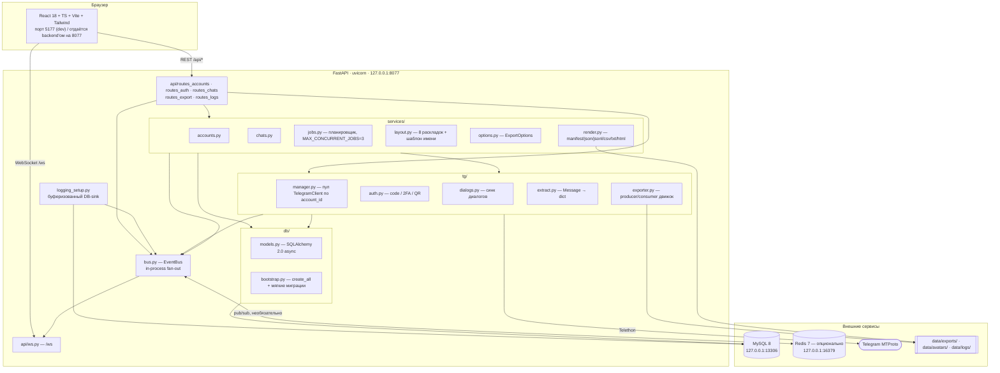
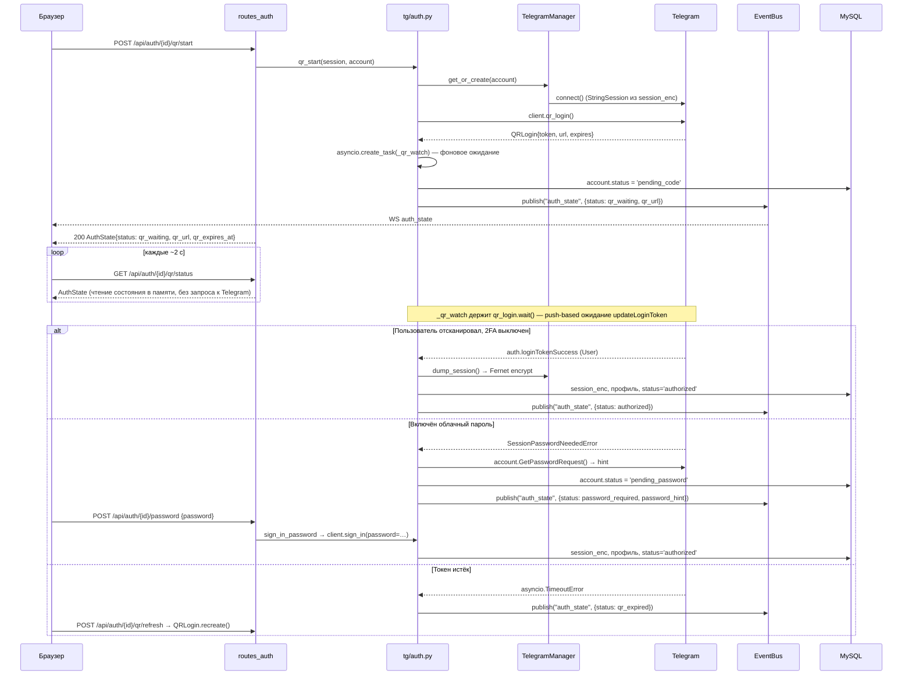
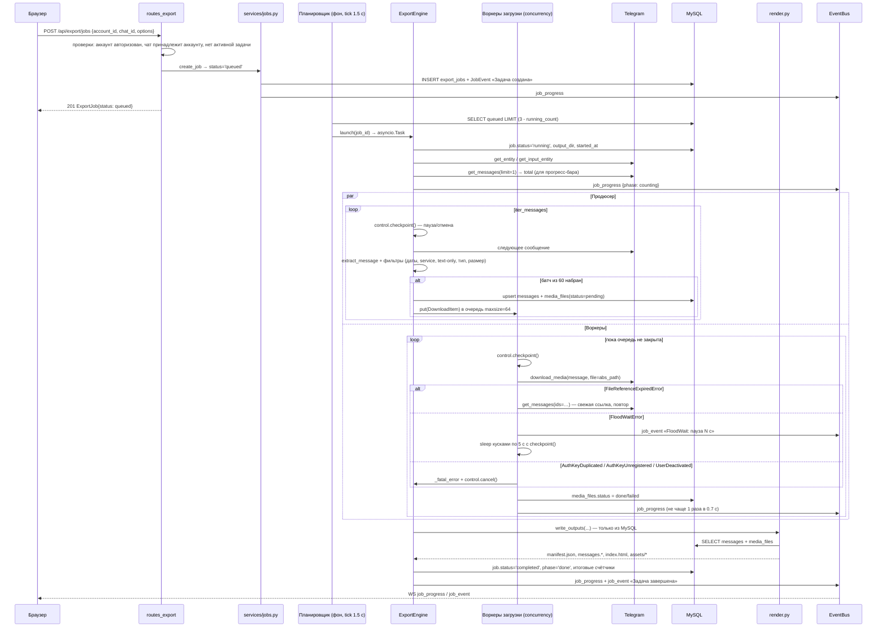

# Архитектура

Назад: [README](../README.md) · Смежное: [DATABASE](DATABASE.md) · [API](API.md) · [CONTRACT](CONTRACT.md)

---

## 1. Компоненты



Стек: Python 3.12, FastAPI, uvicorn, SQLAlchemy 2.0 (async) + aiomysql, Telethon (MTProto,
пользовательский аккаунт), `cryptography` Fernet, Redis (опционально), React 18 + TypeScript +
Vite + TailwindCSS.

---

## 2. Жизненный цикл запросов

### 2.1 Вход по QR



### 2.2 Синхронизация чатов

```mermaid
sequenceDiagram
    participant B as Браузер
    participant A as routes_accounts
    participant D as tg/dialogs.py
    participant M as TelegramManager
    participant T as Telegram
    participant DB as MySQL
    participant BUS as EventBus

    B->>A: POST /api/accounts/{id}/chats/sync {archived, limit, with_avatars}
    A->>A: проверка account.status == 'authorized' иначе NOT_AUTHORIZED
    A->>D: sync_dialogs(...)
    D->>M: get_or_create → is_user_authorized()
    D->>DB: SELECT все chats аккаунта → словарь по tg_chat_id
    D->>BUS: chat_sync {synced: 0, done: false}

    loop по каждому диалогу (iter_dialogs)
        D->>T: следующая порция диалогов
        T-->>D: Dialog + entity
        D->>D: classify(entity) → user/bot/group/supergroup/channel
        D->>DB: INSERT или UPDATE строки chats
        alt каждые 25 диалогов
            D->>DB: flush
            D->>BUS: chat_sync {synced: N, done: false}
            BUS-->>B: WS chat_sync
        end
    end

    D->>DB: account.last_seen_at = now, flush
    D->>BUS: chat_sync {synced: total, done: true}
    D->>D: asyncio.create_task(_download_avatars) — фон, Semaphore(5)
    A-->>B: 200 {synced, created, updated}

    Note over D,T: аватарки качаются уже после ответа; ошибки здесь косметические
```

### 2.3 Экспорт



---

## 3. Проектные решения

### Один долгоживущий `TelegramClient` на аккаунт, а не на запрос

Логин в Telegram — состояние соединения, а не запроса. `send_code_request` и следующий за ним
`sign_in` обязаны выполняться на **одном и том же** MTProto-подключении: `phone_code_hash` и
ключ авторизации принадлежат именно этому соединению. Клиент на каждый HTTP-запрос сделал бы
вход по коду попросту невозможным и заново прогонял бы DC-handshake на каждый вызов.

`TelegramManager` (`tg/manager.py`) держит словарь `account_id → ClientHandle`. Все клиенты живут
в event loop'е uvicorn — это штатный режим Telethon. У каждого handle свой `asyncio.Lock`, чтобы
двойной клик в UI не переплёл шаги логина. Прокси «запекается» в клиент при конструировании,
поэтому смена `proxy` через `PATCH /api/accounts/{id}` принудительно отключает клиента.

Второе следствие того же ограничения: **одна строка сессии — одно живое подключение**. Две копии
одной сессии приводят не к блокировке файла, а к `AuthKeyDuplicatedError` — сервер уничтожает
ключ, и пользователю нужен повторный вход.

### QR-ожидание вне HTTP-запроса

`QRLogin.wait()` блокируется до момента сканирования и регистрирует обработчик апдейта
`updateLoginToken` **только внутри себя**. Если ждать некому — апдейт теряется и вход не
завершится никогда. Поэтому `qr_start` запускает `asyncio.create_task(_qr_watch(...))` сразу, а
эндпоинт `GET /qr/status` лишь читает `AuthState` из памяти. Опрос со стороны фронтенда в сеть
не ходит.

### Producer/consumer с ограниченной очередью в экспортёре

Один продюсер обходит `iter_messages`, N воркеров качают файлы. Очередь намеренно маленькая
(`maxsize=64`) — это механизм backpressure:

* держать все сообщения канала на 200 000 записей в памяти нельзя;
* перезапрашивать каждое сообщение перед загрузкой — удвоение вызовов API;
* ограниченная очередь снимает обе проблемы: объекты `Message` живут ровно столько, сколько нужно
  файлам «в полёте».

Сообщения пишутся батчами по 60 и коммитятся по мере обработки, поэтому упавшая или отменённая
задача не теряет прогресс.

### Буферизованный лог-синк

Логирование в Python синхронно и может вызываться из потоков Telethon. Запись в MySQL прямо
внутри `emit()` заблокировала бы цикл экспорта. Поэтому `BufferedDbHandler` кладёт запись в
`queue.SimpleQueue`, а фоновая корутина раз в 0.75 с сливает до 200 строк одной транзакцией в
таблицу `app_logs` и параллельно публикует их в шину для живого хвоста в UI. Если БД недоступна,
последние 50 строк батча всё равно уходят в шину — логирование не должно умирать вместе с базой.

Логгеры `sqlalchemy`, `aiomysql`, `asyncio`, `telethon.network`, `uvicorn.access` исключены из
DB-синка: первый вызвал бы рекурсию (SQL о записи SQL), остальные затопили бы таблицу.

Синков четыре: консоль (уровень из `TGV_LOG_LEVEL`), `data/logs/app.log` (всё, ротация 20 МБ × 7),
`data/logs/error.log` (только ERROR, 10 МБ × 5), `data/logs/telegram.log` (отдельно Telethon,
20 МБ × 3), таблица `app_logs` + шина (от INFO).

### Redis необязателен

Шина событий — прежде всего in-process fan-out: каждый WebSocket-клиент получает собственную
очередь на 512 сообщений, и медленная вкладка браузера не может затормозить экспорт (при
переполнении у неё выбрасывается самый старый элемент). Redis добавляет сверху две вещи:
pub/sub, чтобы события мог порождать второй процесс (воркер, CLI), и небольшой KV-кэш.

Если `TGV_REDIS_ENABLED=false` или сервер недоступен — при старте пишется предупреждение и
приложение продолжает работать в in-process режиме. Подписчик и командный клиент подняты
отдельными соединениями: у подписчика `socket_timeout=None`, потому что pub/sub по определению
блокируется на чтении, и таймаут рвал бы подписку каждые несколько секунд. Обрыв подписки
восстанавливается с экспоненциальным backoff до 30 с. Свои же сообщения отфильтровываются по
метке `_origin`, чтобы не доставить их подписчикам дважды.

### Нет миграций Alembic

Схема создаётся `Base.metadata.create_all` и дополняется функцией `_apply_soft_migrations()` в
`db/bootstrap.py`, где каждое утверждение защищено проверкой и повторный запуск — no-op.
Сейчас там одна вещь: удаление FULLTEXT-индекса `ft_messages_text`, если он остался от
ранней версии (см. примечание в конце документа). Механизм рассчитан и на будущие
изменения схемы, которые `create_all` не умеет выразить.

Причина решения прагматичная: `./start.sh` должен быть одним шагом. Локальное десктопное
приложение с одной инсталляцией не выигрывает от истории миграций достаточно, чтобы платить за
неё церемонией `alembic revision`/`upgrade` при каждом изменении модели. По той же причине
статусы и типы хранятся как `VARCHAR` + константы в Python, а не как `ENUM`: добавление нового
значения не требует `ALTER TABLE`. Полный сброс схемы доступен через `reset_db()`
(используется тестами) и `./stop.sh --purge` / `./start.sh --fresh` на уровне docker-томов.

### Пауза / возобновление / отмена: `JobControl`

```python
class JobControl:
    def pause(self)  -> None   # _resume.clear()
    def resume(self) -> None   # _resume.set()
    def cancel(self) -> None   # cancelled = True; _resume.set()
    async def checkpoint(self) -> None
```

Один объект на выполняющуюся задачу, живёт в словаре `exporter.controls[job_id]`. Внутри —
`asyncio.Event` (снятый = пауза) и булев флаг отмены. Метод `checkpoint()` вызывается во всех
безопасных точках прерывания: между сообщениями продюсера, перед постановкой элемента в очередь,
перед каждой попыткой загрузки, между попытками и внутри цикла ожидания FloodWait (кусками по 5 с,
чтобы отмена срабатывала быстро). Отмена реализована как исключение `ExportCancelled`, которое
всплывает до `ExportEngine.run()` — там уже пишется событие и задача корректно завершается.

Воркеры не могут пробросить исключение наружу, поэтому фатальные ошибки сессии
(`AuthKeyDuplicatedError`, `AuthKeyUnregisteredError`, `UserDeactivatedError`) они записывают в
`engine._fatal_error` и дёргают `control.cancel()`; движок отличает такую «отмену» от
пользовательской по наличию `_fatal_error`.

### Планировщик и ограничение параллелизма

Задачи не стартуют прямо из HTTP-обработчика. Фоновый цикл `_scheduler_loop()` раз в 1.5 с
выбирает `queued`-задачи и запускает столько, сколько влезает в `MAX_CONCURRENT_JOBS = 3`.
Это даёт три вещи: жёсткий потолок одновременных обращений к Telegram (защита от флуда),
реальное состояние `queued` для UI и автоматическое восстановление задач после падения процесса.
Цикл обёрнут так, чтобы никогда не умирать: любая ошибка тика логируется и через 5 с работа
продолжается.

Второй уровень ограничения — внутри задачи: `options.concurrency` (1..16, по умолчанию 4)
воркеров загрузки.

---

## 4. Конкурентность и модель отказов

| Ситуация | Как обрабатывается |
|---|---|
| `FloodWaitError` < `TGV_FLOOD_SLEEP_THRESHOLD` (60 с) | Telethon засыпает сам внутри `_call` |
| `FloodWaitError` ≥ порога | движок пишет событие «Ограничение Telegram (FloodWait): пауза N с» и спит кусками по 5 с с `checkpoint()`; пользователь видит осмысленный статус, а не зависший прогресс-бар |
| `FloodWaitError` > 3600 с | `RuntimeError` — задача останавливается: сутки ждать бессмысленно |
| `FileReferenceExpiredError` | сообщение перезапрашивается (`get_messages(ids=…)`), загрузка повторяется со свежей ссылкой. Ссылку нельзя обновить в отрыве от сообщения — это единственный корректный путь |
| Сетевые ошибки (`TimeoutError`, `ConnectionError`, `OSError`) | экспоненциальный backoff `min(2**attempt, 30)` до `TGV_MAX_RETRIES` попыток |
| `RPCError` при обходе истории | событие уровня error, задача падает |
| `ChannelPrivateError`, `ChatAdminRequiredError` | «Нет доступа к чату», задача → `failed` |
| `AuthKeyDuplicatedError` | сессия уничтожена сервером: аккаунт → `unauthorized`, **`session_enc` обнуляется**, клиент отключается, задача → `failed`. Нужен полный повторный вход |
| `AuthKeyUnregisteredError`, `UserDeactivatedError` | аккаунт → `unauthorized` с текстом ошибки, клиент отключается (строка сессии сохраняется) |
| Один файл не скачался после всех попыток | `media_files.status = failed` + текст ошибки; пустой нулевой файл удаляется с диска; **задача продолжается** |
| Неизвестное исключение в задаче | ловится в `ExportEngine.run()`, логируется со стектрейсом, задача → `failed`. Приложение не падает |
| Падение/перезапуск процесса | `recover_interrupted()` в lifespan переводит все `running`/`paused` в `queued`, добавляет событие о перезапуске; планировщик стартует их заново. Безопасно, так как движок идемпотентен |
| Восстановление аккаунтов при старте | `_reconnect_accounts()` поднимает клиентов по сохранённым сессиям; ошибка одного аккаунта записывается в `last_error`, а не роняет старт |
| MySQL недоступен на старте | `wait_for_database()` ждёт до 90 с с ретраями, затем падает с внятным сообщением про Docker |
| MySQL недоступен во время работы | лог-синк деградирует на шину; запросы к API возвращают 500 `INTERNAL_ERROR`; `/api/health` отдаёт `status: degraded`, `db: false` |
| Redis недоступен | предупреждение при старте либо реконнект подписчика с backoff; всё продолжает работать in-process |
| Медленный WebSocket-клиент | у его очереди (512) выбрасывается самый старый элемент; при переполнении дважды подряд подписка снимается |

Все ошибки API имеют единый формат тела `{"detail": "...", "code": "MACHINE_CODE"}` —
см. [API.md](API.md#коды-ошибок).

---

## 5. Отклонения от контракта

Список расхождений реализации с [docs/CONTRACT.md](CONTRACT.md). **Верна реализация** — контракт
здесь описывает намерение, а не факт.

> Первая редакция этого раздела содержала 12 пунктов. Большинство из них были не
> «расхождениями документа», а недоделками кода, и их починили: `GET /api/files/thumb`
> реализован, `download_thumbs` и `download_avatars` теперь действительно работают,
> сортировка сообщений по размеру появилась, `TGV_DOWNLOAD_CONCURRENCY` стал дефолтом
> для `ExportOptions.concurrency`, `POST /api/system/open-folder` ограничен каталогом
> данных, а `ts` в WS-сообщении `hello` больше не `null`. Контракт, в свою очередь,
> дополнен `GET /api/stats`, кодами 201 и фактическими параметрами эндпоинтов.
> Ниже — то, что осталось расхождением сознательно.

### API

| Контракт | Реализация |
|---|---|
| §4.3 сортировка чатов `order=asc\|desc`, дефолт не указан | Дефолт `order=desc`, `sort=last_message`. `NULL`-значения принудительно уходят в конец в **обеих** сортировках — через ведущий ключ `col IS NULL`, потому что MySQL не поддерживает `NULLS LAST` (SQLAlchemy `.nullslast()` роняет запрос с ошибкой 1064) |
| §4.3 `media_type` перечисляет конкретные типы | Дополнительно принимается `media_type=any` — «любое сообщение с вложением» |

### БД

| Контракт | Реализация |
|---|---|
| §2 колонки `accounts.status`, `chats.kind`, `messages.media_type`, `media_files.status`, `export_jobs.status` объявлены `ENUM` | Все они — `VARCHAR` + кортежи допустимых значений в `db/base.py` (`ACCOUNT_STATUSES`, `CHAT_KINDS`, `MEDIA_TYPES`, `FILE_STATUSES`, `JOB_STATUSES`, `JOB_PHASES`). Причина — миграции: добавить значение в `VARCHAR` не требует `ALTER TABLE`, а проверка всё равно живёт в pydantic-слое |
| §2 «Все `id` — `BIGINT UNSIGNED AUTO_INCREMENT`» | Используется знаковый `BIGINT` (`sqlalchemy.BigInteger`). Практического значения не имеет: `tg_chat_id` каналов отрицателен по природе, а положительные id Telegram далеко не доходят до `2^63` |
| §2.5 `export_jobs.phase VARCHAR(32)` | `VARCHAR(16)` |
| §2.4 `media_files.sha256 CHAR(64)` | `VARCHAR(64)`; **колонка никогда не заполняется** — хэши не считаются |
| §2 «Всё, что приходит из Telegram, сохраняется в `raw JSON`» | В `messages.raw` пишется не полный `to_dict()`, а компактный срез (`silent`, `noforwards`, `pinned`, `ttl_period`, `via_bot_id`, опрос, контакт, гео, web-preview, стикерсет, emoji) — полный дамп многократно раздул бы базу |
| §2.4 индекс `INDEX(status)` на `media_files` и т.д. | Совпадает; дополнительно `messages.account_id` и `chats.account_id` имеют собственные индексы (`index=True` на колонке) |

### Файлы и вывод

| Контракт | Реализация |
|---|---|
| §6 `manifest.json` → `files[].id` | Записываются `message_id`, `kind`, `rel_path`, `size`, `status`. **Поля `id` нет** |
| §6 каталог `assets/` содержит `style.css` и `app.js` | Пишется ещё `assets/data.js` — именно в нём лежат данные (`window.TGVAULT_DATA = …`), чтобы просмотрщик работал по `file://` без `fetch()` |
| §6 `manifest.json` → `chat` | Дополнительно содержит `about` и `participants_count`, а корень манифеста — `job_id` |

### WebSocket

| Контракт | Реализация |
|---|---|
| §5 клиент шлёт `ping` → сервер отвечает `pong` | Так и есть, но сервер дополнительно шлёт **незапрошенный** `{"type":"pong"}` каждые 25 с как heartbeat, чтобы прокси не рвали простаивающий сокет |

### Конфигурация

| Контракт | Реализация |
|---|---|
| §7 перечисляет 15 переменных | `config.py` понимает ещё `TGV_DATABASE_URL`, `TGV_DB_POOL_SIZE`, `TGV_DB_MAX_OVERFLOW`, `TGV_SERVE_FRONTEND`, `TGV_REQUEST_RETRIES`, `TGV_CONNECTION_RETRIES`, `TGV_EXTRA_OPEN_ROOTS`. Поле `TGV_OPEN_BROWSER` читается, но браузер открывает `start.sh`, а не приложение |
| §0 «БД MySQL 8» | Есть необъявленный запасной путь: `TGV_DATABASE_URL=sqlite+aiosqlite:///…` — типы колонок в `db/base.py` специально сделаны портабельными для быстрых smoke-прогонов без Docker. Мягкие миграции на SQLite не применяются |

> **О полнотекстовом индексе.** Ранняя версия создавала `FULLTEXT ft_messages_text`
> на `messages.text`. Индекс удалён и `bootstrap.py` теперь его сносит, если находит:
> поиск по сообщениям — подстрочный (`LIKE '%…%'`), а `FULLTEXT` работает по словам,
> то есть запрос «порт» не нашёл бы «экспорт». Неиспользуемый индекс только замедлял
> вставку на больших экспортах.
